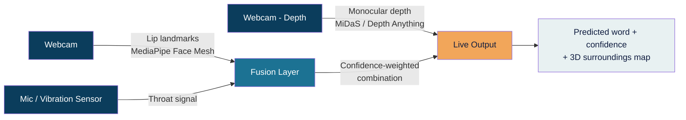

# VisoVibe

**Silent speech recognition + real-time 3D spatial mapping, fused into one system.**

VisoVibe reads what you can't say out loud. It's a modular sensor-fusion pipeline — built from nothing but a webcam and a mic — that combines lip landmark tracking, throat vibration sensing, and monocular depth estimation into a single real-time assistive system for silent communication and spatial awareness.

🏆 **3rd Place — Cupherverse 2026** (Machine Learning / Accessibility track)

---

## Table of Contents

- [Overview](#overview)
- [Architecture](#architecture)
- [How It Works](#how-it-works)
- [Tech Stack](#tech-stack)
- [Getting Started](#getting-started)
- [Project Structure](#project-structure)
- [Status](#status)
- [Roadmap](#roadmap)
- [IP & Research](#ip--research)
- [Team](#team)
- [License](#license)
- [Acknowledgments](#acknowledgments)

---

## Overview

Most assistive technology solves one problem at a time — communication *or* navigation, rarely both. VisoVibe fuses three signals into one pipeline:

- **See** — lip landmark tracking reads silently mouthed words
- **Feel** — throat vibration sensing resolves lip shapes that look identical (e.g. `p` / `b` / `m`)
- **Map** — monocular depth estimation builds a live 3D map of the user's surroundings

No audible speech required. No specialized hardware to get started. Built entirely on consumer-grade sensors, with a defined upgrade path to dedicated hardware.

## Architecture



Each module is independently testable and exposes a simple interface — a predicted label plus a confidence score — to the fusion layer. This made it possible to build all three modules in parallel across a four-person team within a 24-hour build window, and it means any module can be swapped or upgraded (e.g. simulated throat signal → real piezo sensor) without touching the rest of the pipeline.

## How It Works

### 👁 See — Lip Reading
MediaPipe Face Mesh extracts lip landmarks from the live webcam feed. Landmark sequences are normalized for position and scale, then matched against a small library of recorded word templates using Dynamic Time Warping (DTW). Outputs a predicted word plus a confidence score.

### 〜 Feel — Throat Vibration Sensing
Exists specifically to resolve visemes that lip reading can't distinguish on its own. Target hardware is a piezoelectric contact sensor at the throat via an ESP32/Arduino; the current build falls back to simulated input via microphone where hardware isn't available, and this is disclosed openly rather than presented as equivalent.

###▢ Map — 3D Spatial Mapping
Pretrained monocular depth models (MiDaS / Depth Anything) turn a single webcam frame into a live depth map, rendered as a real-time point cloud. Runs independently of the other two modules — useful on its own as a low-cost navigation aid.

### Fusion Layer
Combines lip and vibration confidence scores via confidence-weighted voting: when both modules agree, confidence is boosted; when they disagree, the higher-confidence module wins, with the disagreement logged for threshold tuning.

## Tech Stack

| Component | Technology | Role |
|---|---|---|
| Lip landmark extraction | MediaPipe Face Mesh | Real-time facial landmark detection |
| Video capture | OpenCV | Webcam frame acquisition & preprocessing |
| Sequence matching | SciPy / fastdtw | DTW-based template classification |
| Numerical processing | NumPy | Landmark normalization & signal processing |
| Depth estimation | MiDaS / Depth Anything | Monocular depth prediction from RGB frames |
| 3D visualization | Three.js / Open3D | Real-time point cloud rendering |
| Module integration | Flask / WebSocket | Communication between modules & fusion layer |
| Optional classifier upgrade | scikit-learn (Random Forest) | Trainable alternative to DTW |

## Getting Started

```bash
# Clone the repo
git clone https://github.com/<Shre-Sat>/VisoVibe.git
cd visovibe

# Create a virtual environment
python -m venv venv
source venv/bin/activate      # Windows: venv\Scripts\activate

# Install dependencies
pip install -r requirements.txt

# Run the lip reading module standalone
python modules/lip_reading/main.py

# Run the full fused pipeline
python main.py
```

### Requirements
- Python 3.10+
- A webcam
- A microphone (for the throat-vibration fallback signal)

## Project Structure

```
visovibe/
├── modules/
│   ├── lip_reading/         # MediaPipe landmark extraction + DTW matching
│   ├── throat_vibration/    # Vibration/mic signal capture + disambiguation
│   └── depth_mapping/       # Monocular depth estimation + point cloud viz
├── fusion/                  # Confidence-weighted fusion layer
├── templates/                # Recorded word templates for DTW matching
├── docs/
│   ├── architecture_diagram.png
│   └── VISOVIBE_research_paper.docx
├── requirements.txt
└── main.py
```

## Status

| Module | Status |
|---|---|
| Lip landmark tracking | ✅ Live |
| 3D depth mapping | ✅ Live |
| Throat vibration sensing | ⚠️ Simulated (real piezo sensor pending) |
| Fusion layer | 🔧 Integrating |

## Roadmap

- [ ] Replace simulated throat signal with real piezoelectric sensor (ESP32/Arduino)
- [ ] Integrate true LiDAR / stereo depth cameras for production-grade spatial accuracy
- [ ] Investigate EMG-based subvocal recognition for full silent-speech transcription
- [ ] Add text-to-speech output for real-time spoken feedback
- [ ] Expand vocabulary beyond the current fixed word list
- [ ] Cross-speaker template collection and generalization testing
- [ ] Structured user study with speech- and hearing-impaired participants

## IP & Research

The core technical contribution — the confidence-weighted fusion method for cross-modal viseme disambiguation — is a provisional patent filing candidate. A full technical writeup, including system architecture, methodology, and an honest evaluation of what's implemented versus simulated versus roadmap, is available in [`docs/VISOVIBE_research_paper.docx`](docs/VISOVIBE_research_paper.docx).

## Team

Built by a team of four over 24 hours. See [research paper](docs/VISOVIBE_research_paper.docx) for role breakdown.

## License

*Add your chosen license here (e.g. MIT, Apache 2.0).*

## Acknowledgments

Built on top of [MediaPipe](https://github.com/google-ai-edge/mediapipe), [MiDaS](https://github.com/isl-org/MiDaS), and the broader open-source computer vision community.
